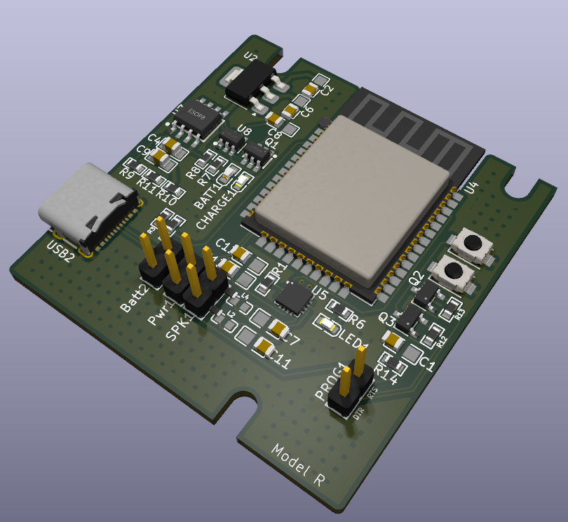
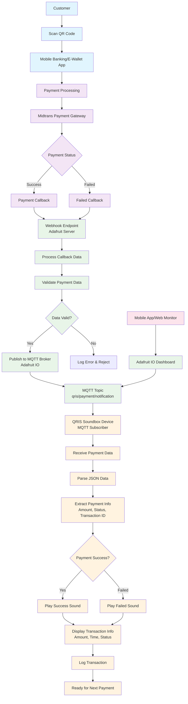

# QRIS Soundbox System - Complete Documentation

## Project Overview

QRIS Soundbox adalah sistem notifikasi pembayaran realtime yang dikembangkan untuk menerima dan memproses notifikasi pembayaran QRIS melalui protokol MQTT. Sistem ini mengintegrasikan payment gateway Midtrans dengan device soundbox melalui Adafruit server yang berfungsi sebagai webhook endpoint dan MQTT broker.

## PCB design


## System Architecture

### Core Components

1. **Payment Gateway**: Midtrans sebagai processor pembayaran QRIS
2. **Server Infrastructure**: Adafruit server dengan webhook endpoint dan MQTT broker
3. **QRIS Soundbox Device**: Device subscriber yang memberikan feedback audio dan visual
4. **Monitoring Dashboard**: Adafruit IO untuk monitoring dan logging

### Technology Stack

- **Payment Processing**: Midtrans Payment Gateway
- **Communication Protocol**: MQTT (Message Queuing Telemetry Transport)
- **Server Platform**: Adafruit IO
- **Device Communication**: MQTT Subscribe/Publish pattern
- **Data Format**: JSON for payment callback data

## System Flow Documentation

### 1. Payment Initiation Flow

**Customer Journey:**
- Customer melakukan scan QR code menggunakan mobile banking atau e-wallet
- Aplikasi mobile memproses pembayaran melalui sistem perbankan
- Data pembayaran diteruskan ke Midtrans payment gateway untuk processing

### 2. Payment Processing Flow

**Midtrans Processing:**
- Midtrans memvalidasi dan memproses transaksi pembayaran
- System menentukan status pembayaran (Success/Failed)
- Callback notification digenerate berdasarkan hasil processing

### 3. Webhook Callback Flow

**Server Side Processing:**
- Midtrans mengirim HTTP POST callback ke webhook endpoint Adafruit server
- Server menerima dan memvalidasi data callback
- Data callback diparse dan diverifikasi integritasnya
- Jika valid, data diproses untuk publikasi ke MQTT broker

**Data Validation Steps:**
- Signature verification untuk keamanan
- Transaction ID validation
- Amount dan merchant validation
- Timestamp verification

### 4. MQTT Publication Flow

**Message Broadcasting:**
- Validated payment data dipublikasi ke MQTT broker (Adafruit IO)
- Data dikirim ke specific topic: `qris/payment/notification`
- Message format menggunakan JSON structure
- QoS (Quality of Service) level ditentukan untuk reliability

**Sample MQTT Payload:**
```json
{
    "additionalInfo": {
        "issuerID": "93600821",
        "nettAmount": "9990.00",
        "payerName": "TEST",
        "payerPhoneNumber": "9360082112345678919",
        "paymentReferenceNo": "J0CP1INR2LOO",
        "posID": "A01",
        "retrievalReferenceNo": "1cqn60h00775",
        "totalRefund": "0.00"
    },
    "amount": {
        "currency": "IDR",
        "value": "10000.00"
    },
    "latestTransactionStatus": "00",
    "originalPartnerReferenceNo": "23545346"
}
```

### 5. Device Subscription Flow

**QRIS Soundbox Processing:**
- Device maintain persistent connection ke MQTT broker
- Subscribe ke topic `qris/payment/notification`
- Receive realtime notification ketika ada payment baru
- Parse JSON payload untuk extract payment information

### 6. User Feedback Flow

**Audio & Visual Feedback:**
- **Success Payment**: Play success sound + display transaction details
- **Failed Payment**: Play error sound + display failure message
- **Display Information**: Amount, transaction time, status, transaction ID
- **Logging**: Record transaction untuk audit trail

### 7. Monitoring & Analytics Flow

**Dashboard Integration:**
- Adafruit IO dashboard menampilkan realtime payment statistics
- Mobile app atau web interface untuk remote monitoring
- Transaction history dan analytics
- Device status monitoring (online/offline)

## Technical Implementation Details

### MQTT Configuration

**Broker Settings:**
- **Host**: io.adafruit.com
- **Port**: 1883 (non-SSL) atau 8883 (SSL)
- **Username**: Adafruit IO username
- **Key**: Adafruit IO key
- **Keep Alive**: 60 seconds
- **Clean Session**: True


### Webhook Endpoint Configuration

**Midtrans Webhook Setup:**
- **URL**: `https://io.adafruit.com/api/v2/webhooks/[webhook-key]`
- **Method**: POST
- **Content-Type**: application/json
- **Timeout**: 30 seconds
- **Retry**: 3 attempts dengan exponential backoff

### Error Handling Strategy

**Connection Resilience:**
- Auto-reconnect untuk MQTT connection
- Offline message queuing
- Retry mechanism untuk failed callbacks
- Graceful degradation ketika server unavailable

**Data Integrity:**
- Duplicate transaction detection
- Checksum verification
- Transaction sequence validation
- Timeout handling untuk stuck transactions

### Security Considerations

**Data Protection:**
- HTTPS untuk webhook communications
- MQTT over SSL/TLS
- Signature validation dari Midtrans
- API key rotation policy
- Access control untuk MQTT topics

**Privacy Compliance:**
- Customer data anonymization
- PCI DSS compliance untuk payment data
- Log data retention policy
- Secure storage untuk transaction records

## Deployment Architecture

### Production Environment

**Infrastructure Requirements:**
- Reliable internet connection untuk device
- Backup power supply untuk continuous operation
- Local storage untuk offline transaction queuing
- Audio output system untuk sound notifications

**Scalability Considerations:**
- Multiple device support dengan unique client IDs
- Load balancing untuk high-volume transactions
- Database optimization untuk transaction storage
- Caching strategy untuk frequent queries

---

## System Flow Diagram


